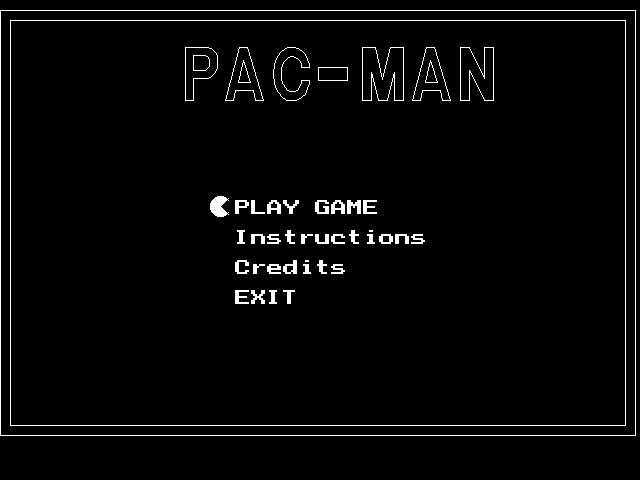
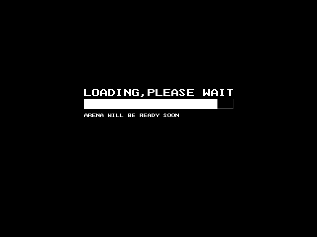
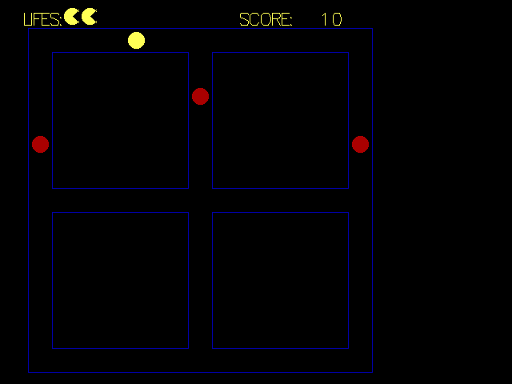
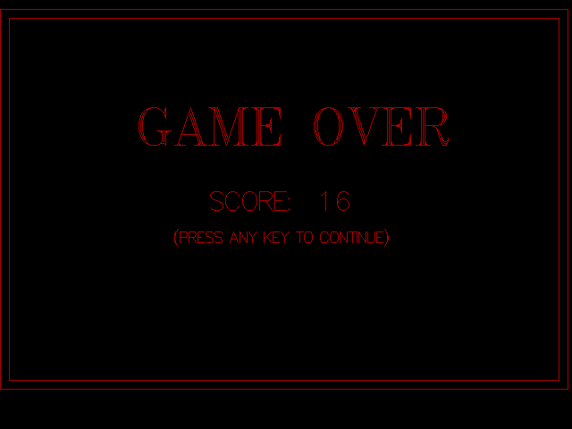

# Pacman--C-  :sunglasses:

This is a code for a basic Pacman Game using **C++**.

It is based around the library, **graphic.h**. Unluckly this library is a bit outdated and may not work with the newer coding platforms.

This code was coded using TurboC Compiler.

## Here are some pictures:   
1. Intro page:

  

2. Loading screen:

  
  
3. Game:

  
 
4. Game over:

  
